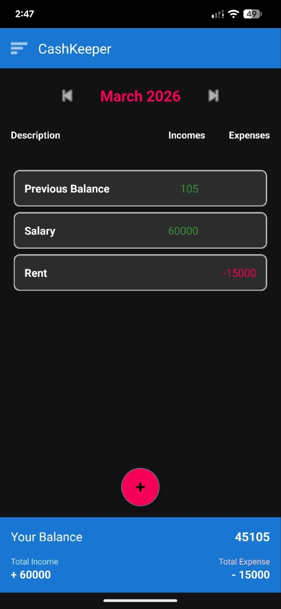
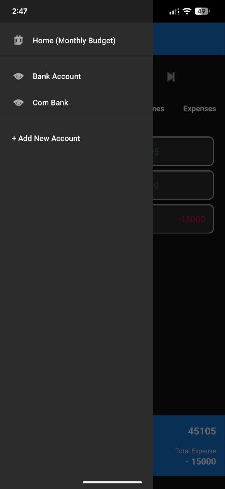
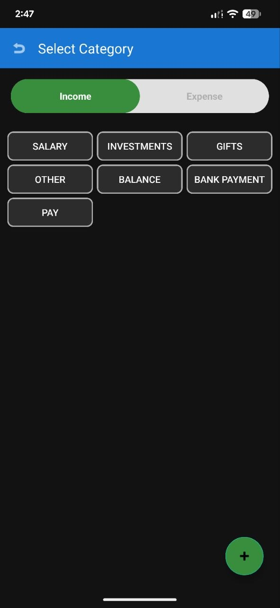

# BudgetBuddy 💰

A sleek, offline-first personal finance tracker built natively for Android. BudgetBuddy (also operating under the internal interface name CashKeeper) is designed to help users take control of their personal finances through a fast, intuitive, and dynamic user interface.

## 🚀 Overview

BudgetBuddy moves beyond simple expense tracking by offering a **Multi-Account Ledger** system. Users can maintain a unified "Home" view for their overall monthly budget, while simultaneously creating isolated ledgers for specific bank accounts, wallets, or custom savings goals. Everything is powered locally via a robust SQLite Room Database, ensuring complete privacy and offline functionality.

## ✨ Key Features

* **Multi-Account Management:** Create, switch between, and manage multiple financial accounts using a custom Material Design navigation drawer.
* **Monthly Summaries:** Dynamic home screen that tracks total balance, income, and expenses month-by-month.
* **Full CRUD Functionality:** * Add, edit, and delete transactions with ease.
    * Update transaction amounts on the fly using custom dialogs.
    * Long-press categories and accounts to trigger floating popup menus for quick deletion.
* **Interactive UI:** Features expanding transaction detail cards, dynamic bottom bar summaries, and an intuitive custom input grid for selecting categories.
* **Completely Offline:** Built with an offline-first architecture. No internet connection is required to log or view your financial data.

## 🛠️ Tech Stack

* **Language:** Java
* **Framework:** Android SDK
* **Database:** Room Persistence Library (SQLite)
* **UI Components:** * `RecyclerView` with custom Adapters
    * `DrawerLayout` & `NavigationView`
    * Material Design `FloatingActionButton` and custom XML shapes/themes.
* **Architecture:** DAO (Data Access Object) pattern for database interactions.

## 📸 Screenshots


|            Home / Monthly View            |              Account Ledger               |              Add Transaction              |
|:-----------------------------------------:|:-----------------------------------------:|:-----------------------------------------:|
|  |  |  |

## 💻 Installation / How to Run

To test or run this application on your local machine:

1. Clone this repository to your local machine:
   ```bash
   git clone [https://github.com/AsithaWijerathne/BudgetBuddy]